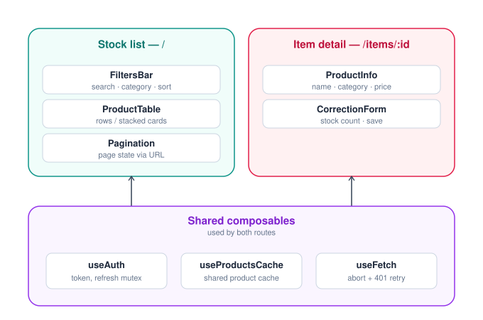

# Clinic Stock Console

An internal console for a clinic’s supplies team to search, filter and update stock counts against the product catalogue. It is designed for use on ward tablets where Wi-Fi can be unreliable, users switch between keyboard and touch. Team members often share links to specific items through chat.

Built using [DummyJSON](https://dummyjson.com/docs) as the product catalogue. The main focus was on building a practical, reliable workflow.

---

## 🚀 Quick Start

### Prerequisites & Tech Stack
- **Node.js**: `>= 22.18.0` (or `v20+`) & `npm`
- **Core Tech**: Vue 3, TypeScript, Vite, Tailwind CSS v3, Vitest, ESLint, Prettier

### Project Setup
```sh
npm install
```

### Development Server
```sh
npm run dev
```

### Testing, Quality Checks & Build
```sh
npm run test:unit    # Run unit tests with Vitest
npm run type-check   # Type-check Vue & TS files
npm run lint         # Run ESLint with auto-fix
npm run format       # Format code with Prettier
npm run format:check # Verify code formatting
npm run build        # Production build
```

---

## Section 1 — Design

### How the screen is divided

I divided the screen into two routes, each having its own shell built around a small number of focused components, both using a shared layer of composables. Below is a visual structure for intuition that I used. I work best with visual structures when designing, so I created a diagram to help me plan the application.



**`/` — Stock list**

| Component | Responsibility |
|---|---|
| `FiltersBar` | search · category · sort |
| `ProductTable` | rows on desktop, stacked cards at tablet width |
| `Pagination` | page state, synced to the URL |

**`/items/:id` — Item detail**

| Component | Responsibility |
|---|---|
| `ProductInfo` | name · category · price · thumbnail |
| `CorrectionForm` | stock count input · save |

**Shared composables** — used by both routes and shared between them. Each route relies on the shared composables to manage the state.

| Composable | Responsibility |
|---|---|
| `useAuth` | token storage, login/logout, refresh mutex |
| `useProductsCache` | single shared product cache |
| `useFetch` | AbortController + 401 retry wrapper |

I designed the stock list to show only what is relevant to a stock decision: thumbnail, title, category, current count. The other information such as brand, price, rating and description stays on the individual product detail page. This is mostly because of the requirement to support 360px-width constraint and to ensure that the stock list fits a tablet screen. 

### Where state lives

There are three types of state in this app, each with its own place. I kept them separate to avoid alot of common issues with state management in larger applications.

- **Server state** - products, categories and the logged-in user are handled by `useProductsCache` and `useAuth`. This data comes from an external source ( DummyJSON for now), can become stale and may be needed by mutliple components.
- **URL state** - search term, category, sort and page are stored directly in the route's query string. They are not copied into component state. This is important because the url is the source of truth. If someone refreshes the page or opens a link shared by colleague they should be able to see the exact same view.
- **Local UI state** - Here lives the temporary things such as the text being currently typed in the search box or a "saving…" indicator that stays inside the component. This state does not need to survive a refresh and cannot be shared therefore no reason to put it in the URL or shared cache.

These three types of state interact in the search box. while the user is typing, the value is local state and once the user stops typing, it is written to the URL using a debounced `router.replace` rather than `push`. Using `push` would create a browser history entry as we type making the back button frustrating to use. The input box also needs to update when the URL changes from somewhere else like a colleague sharing a link or if the user hits the back button. Keeping this two way sync is important for a good user experience. Otherwise the search box can show one value while the app is actually searching for another. 

### Fetching, caching, invalidation

I avoided Pinia and vue-query and used a few small composables instead. The shared state is simple enough and mainly contains an auth token, product cache and refresh state. Adding a larger state management library would add more complexity than value.

All API requests go through a single `useFetch` wrapper. It handles:

- **Request cancellation** - Uses `AbortController` to cancel an older request when a newer one from the same source starts.
- **Token refresh** - Handles 401 responses in a central point. A shared `refreshPromise` prevents multiple components from trigerring separate refresh requests at the same time. After successful refresh, the original request is retried once. If the refresh token has also expired, the user is logged out instead of entering a retry loop.

`useProductsCache` holds the product list as a single shared ref. After a successful stock update, the returned value from the `PUT` response is applied directly to the cache instead of triggering another fetch. This keeps the UI upto date immediately and avoids unnecessary network requests.

### Layout and styling

I used Tailwindcss with utility classes directly than trying to create a custom design token layer. I felt it could be much effort in respect to the timelines given so i kept this implementation simple and fast. If the app grows I would consider introducing a small semantic pallete such as `primary`, `danger` and `surface` to keep colors consitent across components.
The product table uses alternating row stripes based on the position of the rows currently being rendered. This is important because filtering and pagination change which rows are visible. If I used old or global index this can result in incorrect striping after the list changes.

### Accessibility

I focused on the accessibility requirements that are actually part of the tasks, such as full keyboard operability and readability at 360px. I skipped full screen reader support with ARIA live regions because it was not a requirement and could be alot of work to implement properly within the timelines given.

**Keyboard:**
- All interactive elements including filters, sorting, save buttons and links work with Tab, Enter and Space keys.
- Every focusable element has a visible `focus-visible:ring-2` focus indicator.

**Other usability considerations**
- Important states such as "low stock" and "save failed" are shown with text not color alone. This caters for situations of low color vision and judgement.
- Font sizes use `rem`, and zooming is not restricted.
- Save and error feedback is communicated through visible text changes rather than color alone.

### Decision log

**1. URL as the source of truth**\
**Rejected:** Keeping search, filters, sorting and pagination in local component state.\
**Reasons:** The requirements state that a user should be able to share the exact same view with a colleague by pasting a link and still keep the view when refreshed. This would not be possible if the state was not stored in the URL.

**2. `router.replace` for query changes and `router.push` for navigation.**\
**Rejected:** Using `router.push` for every search, filter or sort change.\
**Reasons:** Every small change would create a browser history entry, so the back button would move through previous filter states instead of navigating back normally. 

**3. App-wide request cancellation with `AbortController`**\
**Rejected:** Using request sequence numbers and which could lead to ignoring stale responses.\
**Reasons:** Sequence numbers prevent outdated results from being displayed but they do not stop the old request from running and completing. AbortController cancels the unnecessary work and can be reused across the app. 

**4. Shared product cache patched after updates**\
**Rejected:** Keeping separate caches per view or invalidating and refetching the list after every stock correction.\
**Reasons:** A shared cache keeps the list and detail views consistent. Since the 'PUT' response already contains the updated value, patching the cache directly avoids unnecessary network requests and keeps the UI up to date immediately.

---

## Section 2 — Build

In this app sign-in gates the app before any stock data loads. The stock list is paginated against `GET /products` and is wired to `FiltersBar` for category/sort/search. Item detail lives at `/items/:id` and the correction form calls `PUT /products/{id}` and on success, it patches `useProductsCache` directly rather than triggering a refetch.

### Project structure

Components are grouped by which route owns them, not by generic type. `FiltersBar` and `ProductTable` live under `stock-list/`, not in one flat `components/` folder, so it's obvious at a glance what belongs to which screen. Composables sit in their own top-level folder since they're deliberately shared and route-agnostic. Test specs are colocated next to the file they cover, rather than mirrored into a separate `tests/` tree. I did this so the app can grow without a later restructure and so a spec is never more than one click from what it tests.

```
clinic-stock-console/
├── .github/
│   └── workflows/
│       └── ci.yml                    # format · lint · commitlint · test → deploy on push / merge to main
├── .husky/
│   └── commit-msg                    # commitlint hook, runs locally
├── public/
│   └── favicon.ico
├── src/
│   ├── main.ts
│   ├── App.vue
│   ├── router/
│   │   └── index.ts                  # route guard lives here
│   ├── views/
│   │   ├── LoginView.vue
│   │   ├── StockListView.vue         # /
│   │   └── ItemDetailView.vue        # /items/:id
│   ├── components/
│   │   ├── stock-list/
│   │   │   ├── FiltersBar.vue
│   │   │   ├── FiltersBar.spec.ts
│   │   │   ├── ProductTable.vue
│   │   │   ├── ProductCard.vue       # stacked-card row, < tablet breakpoint
│   │   │   └── Pagination.vue
│   │   ├── item-detail/
│   │   │   ├── ProductInfo.vue
│   │   │   ├── CorrectionForm.vue
│   │   │   └── CorrectionForm.spec.ts
│   │   └── shared/
│   │       ├── LoadingState.vue
│   │       ├── EmptyState.vue
│   │       └── ErrorState.vue        # includes the recovery action
│   ├── composables/
│   │   ├── useAuth.ts
│   │   ├── useProductsCache.ts
│   │   ├── useFetch.ts               # AbortController + refresh mutex live here
│   │   └── useFetch.spec.ts          # refresh-mutex + search-race-condition tests
│   ├── types/
│   │   └── product.ts
│   └── assets/
│       ├── main.css                  # Tailwind entry
│       └── screen-division.svg       # layout & state architecture diagram
├── .editorconfig
├── eslint.config.js
├── .prettierrc
├── commitlint.config.js
├── tailwind.config.ts
├── tsconfig.json
├── vite.config.ts
├── index.html
├── package.json
└── README.md
```

**API limitation to verify and document once building starts:** whether `PUT /products/{id}` persists the change server-side or simply echoes a fake success — this determines whether the optimistic UI on save is representing real backend state or purely local state, and should be called out explicitly either way.

## Section 3 — Deployment & CI/CD

*I will update this section once I complete building plus testing and get it deployed:* public URL, the branch that triggers deployment and which checks (formatter, linter, commitlint, test suite) can block a merge.

## Section 4 — AI Reflection

### How AI Was Used in This Project

AI was mainly used as a **sounding board for decisions I had already made**. My understanding of the architecture came from my previous experience building an HMIS, and this project followed many of the same patterns on a smaller scale.

The main design discussion was around a few decisions where I wanted to challenge my initial approach:

* **URL state:** I had already chosen the URL as the source of truth for search, filters, sorting and pagination. I used AI to pressure-test that decision against the requirement for reloads and shared links to preserve the exact view.
* **Request cancellation:** I evaluated sequence numbering versus `AbortController` for handling rapid filter inputs. I used AI to quickly analyze trade-offs between ignoring stale payload responses versus aborting the already started requests, confirming my decision to implement `AbortController` to eliminate unnecessary network traffic.
* I used AI to help create the `screen-division.svg` visual that I used to showcase the screen layouts and interactions.

AI also helped with **project scaffolding**. I provided the project structure and architectural organization I wanted, then used Antigravity (AI coding assistant) to help set up the corresponding folders, Tailwind configuration and empty route/component stubs.


### What AI / Tooling Got Wrong and How It Was Resolved

A few issues came from the scaffolding and setup:

* **Dependency conflict:** The Vue scaffolding introduced incompatible `oxlint` and `eslint-plugin-oxlint` versions, causing an `npm install` `ERESOLVE` error. I removed those dependencies and kept the existing ESLint and Prettier setup.
* **Duplicate configuration:** Scaffolding generated additional ESLint and Prettier configuration files where configuration files already existed. I removed the duplicates and kept one configuration for each tool.
* **File nesting:** VS Code file nesting was enabled by the generated settings, which hid some configuration files. I disabled it so the project structure remained visible and easier to inspect.

In each case, I checked what the tooling had generated when running `create-vue` and `npm install`. I identified the issue from the errors shown and I made the corrections before continuing.
